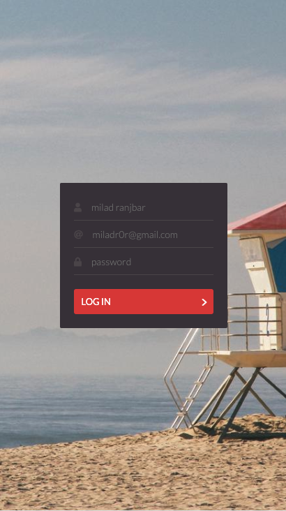

# React Daily UI - Rewrite with react hooks

> A collection of React apps built by [Jack Oliver](http://www.jackoliver.info/react-daily-ui/) and blogged by [Sophia Shoemaker](https://twitter.com/wisecobbler) and the [Fullstack React](https://fullstackreact.com) team.
>
> Check out the full [CodePen collection here](http://codepen.io/collection/DoLZRm/).


## Days
<table>
    <thead>
        <tr>
            <th>Day</th>
            <th>Preview</th>
            <th>Description</th>
            <th>Demo</th>
        </tr>
    </thead>
    <tbody>
        <tr>
            <td><strong>001</strong></td>
            <td></img></td>
            <td>Create a sign-up form</td>
            <td align="center"><a href="https://bxf12.csb.app/">:white_check_mark: :dolphin: :arrow_right:</a></td>
        </tr>
    </tbody>
</table>

## Instructions
All of Jack Oliver's original designs and code are hosted on Codepen. For the purposes of this blog series, we have created this Github repository containing all the code for each daily component. 

We've used the [`create-react-app`](https://github.com/facebookincubator/create-react-app) tool to set up our environment. To run the code `cd` into each individual folder and run the following commands:

1. `npm install` will install all the libraries you'll need to get each Daily UI running.

2. `npm start` compiles all of your files and boots up a dev server. Browse to `localhost:3000` to find your application running.


## Prerequisites
You'll need to have `node` and `npm` installed on your machine to run the commands. Head over to the [node.js](https://nodejs.org/en/) website and download the neccessary files to get those installed. 

## Authors
This series is a joint effort between:

* [Milad Ranjbar](https://github.com/miladr0) 
* [Jack Oliver](http://www.jackoliver.info/react-daily-ui/) 
* [Sophia Shoemaker](https://twitter.com/wisecobbler) 
* [The Fullstack React Team](https://fullstackreact.com)

## Contributing

```shell
git clone https://github.com/miladr0/react-daily-ui.git
cd react-daily-ui
```
___


<div style="clear:both"></div>

